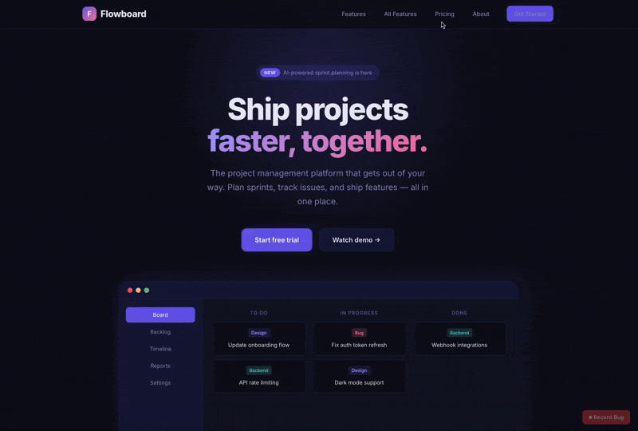

<div align="center">

<h1>bugreel</h1>
Record bugs without screen recording — capture DOM, console, and network as a structured, replayable file you can host yourself.

No SaaS, no tracking, no vendor lock-in. Runs on your own infrastructure.

<a href="https://anthonysendra.github.io/bugreel/">Website</a>



</div>

## Why?

Tools like [jam.dev](https://jam.dev) are great for capturing bugs, but they're SaaS — your DOM snapshots, console logs, and network requests all end up on someone else's servers. For companies that handle sensitive data or simply don't want to send internal app state to a third party, that's a dealbreaker.

I looked for a self-hostable equivalent and couldn't find one. So Claude built this.

---

## Features

### Viewer

- **DOM replay** — pixel-perfect interactive replay powered by rrweb, not a video
- **Scrubber** — seek anywhere in the timeline; all panels sync to the current position
- **Console panel** — logs, warnings, errors and uncaught exceptions with timestamps; scrolls with playback
- **Network panel** — all requests in a table; click any row to expand headers, request body, and status
- **Interactions panel** — ordered list of clicks, inputs, and navigations with seek-to buttons
- **Comments** — timestamped threaded comments; yellow bubbles on the timeline; reply notifications by email
- **DOM inspector** — toggle Inspect mode to hover-highlight any element in the replay with tag, classes and dimensions; click to see attributes and computed styles
- **Open DOM** — extract the current DOM snapshot into a new tab where browser DevTools work natively (no iframe context switching)
- **Playwright export** — one click generates a ready-to-run `.spec.ts` reproduction script from the interaction events

### Recording

| | Firefox extension | SDK (script tag) |
|---|---|---|
| DOM replay (rrweb) | ✅ | ✅ |
| Console logs | ✅ | ✅ |
| Uncaught errors & promise rejections | ✅ | ✅ |
| Network requests (URL, method, headers, status, duration) | ✅ webRequest API | ✅ fetch/XHR intercept |
| Network response bodies | ❌ browser restriction | ✅ JSON up to 5 KB |
| Request body | ✅ | ✅ |
| Click / input / navigation tracking | ✅ | ✅ |
| Font inlining (base64) for faithful replay | ✅ | ✅ |
| Multi-page recording (full-page navigations) | ✅ | ❌ single page |
| Works without install | ❌ | ✅ |
| Auto-upload to workspace | ✅ | ✅ |
| Local download fallback | ✅ | ✅ |
| Permanent recording (rolling buffer) | ❌ | ✅ configurable duration |

Recordings are saved as `.reel` files — gzipped JSON containing all streams.

The SDK supports **permanent recording mode**: instead of manual start/stop, it records continuously in a rolling buffer of a configurable duration (e.g. 10 seconds). When the user clicks "Report Bug", only the last N seconds are captured and uploaded — no need to reproduce the bug, it's already recorded.

### Ticket integrations

Connect your apps to **Linear** or **Jira** to streamline your bug workflow:

- **Create tickets from recordings** — after stopping a recording (SDK) or from the reel player (dashboard), open a modal to create a ticket with a title and description. The reel URL is automatically appended.
- **Bidirectional sync** — marking a reel as "done" closes the linked ticket on Linear/Jira. A background sync job (every 5 min) checks ticket statuses and marks reels as done when their ticket is completed on the provider side.
- **Reel naming** — when a ticket is created, the reel is automatically renamed to `TICKET-ID - Title` for easy identification.

### Webhook notifications (Slack, Discord, Mattermost)

Set up webhook notifications per app in the **Integrations** tab:

- **Events** — get notified on new recordings, new comments, or reels marked as done
- **Compatible with** Slack incoming webhooks, Discord webhooks, Mattermost incoming webhooks, or any HTTP endpoint that accepts JSON POST requests
- **Test** — send a test payload from the UI to verify your webhook is working before saving

### Storage

- **Database** — SQLite with WAL mode (`data/bugreel.db`)
- **Reel files** — local disk by default (`data/reels/`), or any S3-compatible bucket (AWS S3, Cloudflare R2, MinIO)
- **S3 uploads** — extension and SDK upload directly to S3 via presigned PUT URLs; viewer redirects to presigned GET URLs — the API server is never in the data path

---

## Setup

### Web app

```bash
cd app
npm install
npm run dev       # http://localhost:7777
```

### Extensions

```bash
cd recorder
npm install
npm run build
# Load recorder/dist as a temporary extension in about:debugging
```

### SDK (no extension required)

Add one script tag to your site — the endpoint URL comes from your application's **API Tokens** tab:

```html
<script
  src="https://your-bugreel.com/sdk/recorder.js"
  data-endpoint="https://your-bugreel.com/api/ingest?token=API_TOKEN"
></script>
```

This injects a floating **⏺ Record Bug** button. On stop the recording is compressed and uploaded automatically.

---

## Docker

The image is published on Docker Hub as [`patatra/bugreel`](https://hub.docker.com/r/patatra/bugreel).

### Quick start

```bash
docker run -d \
  --name bugreel \
  -p 7777:7777 \
  -v bugreel_data:/app/data \
  -e NUXT_JWT_SECRET=changeme \
  patatra/bugreel:latest
```

Open `http://localhost:7777`.

### docker-compose

```bash
# clone the repo (for docker-compose.yml)
git clone https://github.com/patatra/bugreel
cd bugreel

# edit docker-compose.yml — set NUXT_JWT_SECRET at minimum
docker compose up -d
```

Edit `docker-compose.yml` to configure S3, email, and a public base URL. All options are pre-listed as comments.

### Persistent data

All state lives in `/app/data` inside the container:

| Path | Contents |
|---|---|
| `/app/data/bugreel.db` | SQLite database (users, workspaces, reels) |
| `/app/data/reels/` | `.reel` files (only when not using S3) |

Mount a named volume or host path to preserve data across container restarts.

### Environment variables

| Variable | Required | Description |
|---|---|---|
| `NUXT_JWT_SECRET` | **yes** | Secret used to sign auth tokens |
| `NUXT_PUBLIC_BASE_URL` | no | Public URL for email links (default: `http://localhost:7777`) |
| `NUXT_S3_REGION` | no | S3 region |
| `NUXT_S3_BUCKET` | no | S3 bucket name |
| `NUXT_S3_ACCESS_KEY_ID` | no | S3 access key |
| `NUXT_S3_SECRET_ACCESS_KEY` | no | S3 secret key |
| `NUXT_S3_ENDPOINT` | no | Custom endpoint (R2, MinIO, …) |
| `NUXT_EMAIL_PROVIDER` | no | `smtp` \| `resend` \| `console` |
| `NUXT_EMAIL_FROM` | no | Sender address |
| `NUXT_EMAIL_SMTP_HOST` | no | SMTP host |
| `NUXT_EMAIL_SMTP_PORT` | no | SMTP port (default 587) |
| `NUXT_EMAIL_SMTP_USER` | no | SMTP user |
| `NUXT_EMAIL_SMTP_PASS` | no | SMTP password |
| `NUXT_EMAIL_RESEND_API_KEY` | no | Resend API key |
| `NUXT_PURGE_DONE_DAYS` | no | Days to keep done reels before auto-deletion (default: 7) |
| `ALLOWED_EMAIL_DOMAINS` | no | Comma-separated list of allowed email domains for registration (e.g. `acme.com,example.io`) |

---

## S3 storage (optional)

Set these in `app/.env`:

```env
NUXT_S3_REGION=us-east-1
NUXT_S3_BUCKET=bugreel
NUXT_S3_ACCESS_KEY_ID=your-access-key
NUXT_S3_SECRET_ACCESS_KEY=your-secret-key

# Non-AWS only (Cloudflare R2, MinIO, …)
NUXT_S3_ENDPOINT=https://<account-id>.r2.cloudflarestorage.com
```

All five must be set for S3 to activate. Missing any falls back to local disk silently.

**Bucket CORS** — allow `PUT` from extension/SDK origins:

```json
[{ "AllowedHeaders": ["*"], "AllowedMethods": ["PUT"], "AllowedOrigins": ["*"], "MaxAgeSeconds": 3600 }]
```

---

## Email (optional)

When configured, bugreel sends verification, password reset, workspace invitation, and comment reply emails.

```env
NUXT_EMAIL_PROVIDER=smtp        # smtp | resend | console
NUXT_EMAIL_FROM=noreply@yourcompany.com
NUXT_PUBLIC_BASE_URL=https://bugreel.yourcompany.com

# SMTP
NUXT_EMAIL_SMTP_HOST=smtp.yourprovider.com
NUXT_EMAIL_SMTP_PORT=587
NUXT_EMAIL_SMTP_USER=your-user
NUXT_EMAIL_SMTP_PASS=your-password

# Resend
NUXT_EMAIL_RESEND_API_KEY=re_xxxxxxxxxxxxx
```

Leave `NUXT_EMAIL_PROVIDER` unset to disable all email sending.

---
